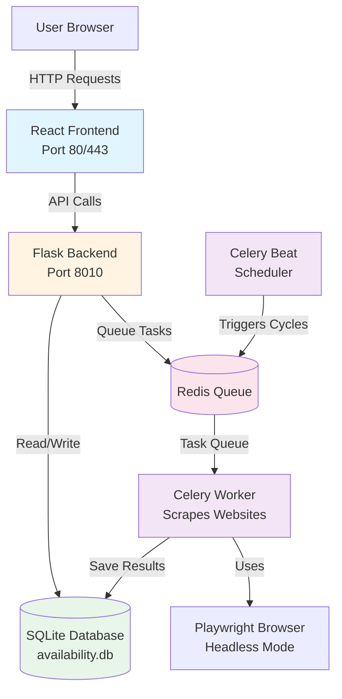

# Deployment Guide - Availability Scraper Application

## Table of Contents

1. [Overview](#overview)
2. [Prerequisites](#prerequisites)
3. [System Architecture](#system-architecture)
4. [Initial Server Setup](#initial-server-setup)
5. [Deploying the Application](#deploying-the-application)
6. [Deploying the Frontend](#deploying-the-frontend)
7. [Verifying the Deployment](#verifying-the-deployment)
8. [Daily Operations](#daily-operations)
9. [Troubleshooting](#troubleshooting)
10. [Backup and Recovery](#backup-and-recovery)

---

## Overview

This guide will help you deploy and maintain the Availability Scraper application on an Ubuntu server. The application consists of:

- **Backend**: A Python Flask application that scrapes restaurant availability data
- **Frontend**: A React web interface for viewing the data
- **Database**: SQLite database storing availability information
- **Task Queue**: Redis and Celery for managing background scraping tasks

**What this application does**: It automatically checks restaurant and activity venue availability in New York and London, storing the results in a database that can be viewed through a web interface.

---

## Prerequisites

Before you begin, you need:

1. **Ubuntu Server** (20.04 LTS or newer recommended)
   - Minimum 2GB RAM (4GB+ recommended)
   - At least 10GB free disk space
   - Root or sudo access

2. **SSH Access** to your server
   - You'll need to connect to the server using SSH (Secure Shell)
   - If you're using a cloud provider (AWS, DigitalOcean, etc.), they usually provide SSH connection instructions

3. **Basic Terminal/Command Line Knowledge**
   - Don't worry - we'll explain each command
   - You'll be copying and pasting commands mostly

4. **Application Files**
   - Either access to a Git repository containing the code
   - Or the application files ready to upload

---

## System Architecture

Here's how the different parts of the application work together:



**Key Components Explained**:

- **Frontend**: The web interface users see in their browser
- **Backend (Flask)**: The API server that handles requests and manages data
- **Database (SQLite)**: Stores all the scraped availability data
- **Redis**: A message queue that coordinates tasks between services
- **Celery Worker**: Performs the actual web scraping in the background
- **Celery Beat**: Automatically triggers scraping cycles at scheduled intervals

---

## Initial Server Setup

### Step 1: Connect to Your Server

1. Open a terminal (on Mac/Linux) or PowerShell/Command Prompt (on Windows)
2. Connect using SSH:
   ```bash
   ssh username@your-server-ip
   ```
   Replace `username` with your server username and `your-server-ip` with your server's IP address.

3. If this is your first time connecting, you may see a security warning. Type `yes` to continue.

### Step 2: Update System Packages

Once connected, update your server's software:

```bash
sudo apt update
sudo apt upgrade -y
```

**What this does**: Updates all installed software to the latest versions for security and stability.

### Step 3: Run the Automated Setup Script

The easiest way to set up everything is using the provided setup script. This script will:

- Install Python, Redis, and other required software
- Install Google Chrome (needed for web scraping)
- Set up the application directory
- Create system services that automatically start the application
- Configure the firewall

**To run the setup script**:

1. First, make sure you have the application files on your server. You can either:
   - Clone from Git: `git clone <your-repository-url> /opt/scrapping`
   - Or upload files using SCP/FTP

2. Navigate to the application directory:
   ```bash
   cd /opt/scrapping
   ```

3. Make the setup script executable:
   ```bash
   chmod +x setup_ubuntu_server.sh
   ```

4. Run the setup script:
   ```bash
   bash setup_ubuntu_server.sh
   ```

5. The script will take 10-15 minutes to complete. It will:
   - Install all required software
   - Set up Python virtual environment
   - Install Python packages
   - Download browser files for Playwright
   - Create system services
   - Start the application

6. **Important**: Watch for any error messages. If you see errors in red, note them down.

### Step 4: Verify Setup

After the script completes, check that all services are running:

```bash
sudo systemctl status backend-scraper-flask
sudo systemctl status backend-scraper-celery-worker
sudo systemctl status backend-scraper-celery-beat
```

**What to look for**: You should see "active (running)" in green for each service.

If any service shows "failed" or "inactive", see the [Troubleshooting](#troubleshooting) section.

---

## Deploying the Application

### Understanding the Application Structure

The application files should be located at `/opt/scrapping/`. Here's what's important:

- `app.py` - Main Flask application
- `celery_app.py` - Task queue configuration
- `requirements.txt` - Python package dependencies
- `models.py` - Database structure
- `scrapers/` - Individual website scrapers
- `frontend/` - React frontend application
- `availability.db` - SQLite database (created automatically)

### Application Services

The application runs as three separate services:

1. **backend-scraper-flask**: The main API server (port 8010)
2. **backend-scraper-celery-worker**: Background worker that performs scraping
3. **backend-scraper-celery-beat**: Scheduler that triggers scraping cycles

These services are managed by systemd (Linux's service manager) and will:
- Start automatically when the server boots
- Restart automatically if they crash
- Run in the background without needing a terminal

### Service Management Commands

**Check if services are running**:
```bash
sudo systemctl status backend-scraper-flask
sudo systemctl status backend-scraper-celery-worker
sudo systemctl status backend-scraper-celery-beat
```

**Start services** (if they're stopped):
```bash
sudo systemctl start backend-scraper-flask
sudo systemctl start backend-scraper-celery-worker
sudo systemctl start backend-scraper-celery-beat
```

**Stop services**:
```bash
sudo systemctl stop backend-scraper-flask
sudo systemctl stop backend-scraper-celery-worker
sudo systemctl stop backend-scraper-celery-beat
```

**Restart services** (useful after updates):
```bash
sudo systemctl restart backend-scraper-flask
sudo systemctl restart backend-scraper-celery-worker
sudo systemctl restart backend-scraper-celery-beat
```

**View service logs** (to see what's happening):
```bash
# View live logs (press Ctrl+C to exit)
sudo journalctl -u backend-scraper-flask -f
sudo journalctl -u backend-scraper-celery-worker -f
sudo journalctl -u backend-scraper-celery-beat -f

# View last 100 lines
sudo journalctl -u backend-scraper-flask -n 100
```

---

## Deploying the Frontend

The frontend is a React application that needs to be built and served. You have two options:

### Option 1: Using Nginx (Recommended)

Nginx is a web server that's better suited for serving static files and can handle more traffic.

#### Step 1: Install Nginx

```bash
sudo apt install -y nginx
sudo systemctl start nginx
sudo systemctl enable nginx
```

#### Step 2: Build the Frontend

1. Navigate to the frontend directory:
   ```bash
   cd /opt/scrapping/frontend
   ```

2. Install Node.js and npm (if not already installed):
   ```bash
   curl -fsSL https://deb.nodesource.com/setup_18.x | sudo -E bash -
   sudo apt install -y nodejs
   ```

3. Install frontend dependencies:
   ```bash
   npm install
   ```

4. Set the API endpoint environment variable:
   ```bash
   # Replace YOUR_SERVER_IP with your actual server IP or domain
   export VITE_API_BASE=http://YOUR_SERVER_IP:8010/api
   ```
   
   Or create a `.env.production` file in the frontend directory:
   ```bash
   echo "VITE_API_BASE=http://YOUR_SERVER_IP:8010/api" > .env.production
   ```

5. Build the frontend:
   ```bash
   npm run build
   ```
   
   This creates a `dist` folder with the compiled frontend files.

#### Step 3: Configure Nginx

1. Create an Nginx configuration file:
   ```bash
   sudo nano /etc/nginx/sites-available/availability-scraper
   ```

2. Paste the following configuration (replace `YOUR_SERVER_IP` with your server IP or domain):
   ```nginx
   server {
       listen 80;
       server_name YOUR_SERVER_IP;  # Replace with your domain or IP
       
       # Serve frontend files
       root /opt/scrapping/frontend/dist;
       index index.html;
       
       # Handle React Router (for future use)
       location / {
           try_files $uri $uri/ /index.html;
       }
       
       # Proxy API requests to Flask backend
       location /api {
           proxy_pass http://localhost:8010;
           proxy_set_header Host $host;
           proxy_set_header X-Real-IP $remote_addr;
           proxy_set_header X-Forwarded-For $proxy_add_x_forwarded_for;
           proxy_set_header X-Forwarded-Proto $scheme;
       }
   }
   ```

3. Save and exit (Ctrl+X, then Y, then Enter in nano)

4. Enable the site:
   ```bash
   sudo ln -s /etc/nginx/sites-available/availability-scraper /etc/nginx/sites-enabled/
   ```

5. Test the configuration:
   ```bash
   sudo nginx -t
   ```

6. If the test passes, reload Nginx:
   ```bash
   sudo nginx -s reload
   ```

7. Open port 80 in the firewall:
   ```bash
   sudo ufw allow 80/tcp
   ```

#### Step 4: Access the Frontend

Open your web browser and navigate to:
```
http://YOUR_SERVER_IP
```

You should see the availability scraper interface.

### Option 2: Using Flask to Serve Static Files

If you prefer not to install Nginx, you can configure Flask to serve the frontend files directly.

#### Step 1: Build the Frontend

Follow steps 1-5 from Option 1 above to build the frontend.

#### Step 2: Modify Flask to Serve Static Files

1. Edit the Flask application:
   ```bash
   sudo nano /opt/scrapping/app.py
   ```

2. Find the `@app.route('/')` function (around line 520) and replace it with:
   ```python
   @app.route('/')
   def index():
       return app.send_static_file('index.html')
   
   @app.route('/<path:path>')
   def serve_static(path):
       return app.send_static_file(path)
   ```

3. Add this near the top of the file (after the Flask app creation):
   ```python
   # Configure Flask to serve static files from frontend/dist
   import os
   frontend_dist = os.path.join(os.path.dirname(__file__), 'frontend', 'dist')
   if os.path.exists(frontend_dist):
       app = Flask(__name__, static_folder=frontend_dist, static_url_path='')
   ```

4. Save and restart Flask:
   ```bash
   sudo systemctl restart backend-scraper-flask
   ```

**Note**: This method is simpler but Nginx is recommended for production use as it's more efficient and secure.

---

## Verifying the Deployment

### Check Backend API

1. Test the health endpoint:
   ```bash
   curl http://localhost:8010/api/health
   ```
   
   You should see a JSON response with status information.

2. Test from your local computer (replace with your server IP):
   ```bash
   curl http://YOUR_SERVER_IP:8010/api/health
   ```

### Check Frontend

1. Open your web browser
2. Navigate to `http://YOUR_SERVER_IP` (or your domain)
3. You should see the availability scraper interface
4. Try searching for availability - data should load if scraping has started

### Check Scraping is Working

1. View worker logs to see if scraping tasks are running:
   ```bash
   sudo journalctl -u backend-scraper-celery-worker -n 50
   ```
   
   You should see messages about scraping tasks being executed.

2. Check the database for data:
   ```bash
   cd /opt/scrapping
   sqlite3 availability.db "SELECT COUNT(*) FROM availability_slots;"
   ```
   
   This shows how many availability records have been scraped.

---

## Daily Operations

### Starting the Application

The application should start automatically when the server boots. If you need to start it manually:

```bash
sudo systemctl start backend-scraper-flask
sudo systemctl start backend-scraper-celery-worker
sudo systemctl start backend-scraper-celery-beat
```

### Stopping the Application

To stop all services:

```bash
sudo systemctl stop backend-scraper-flask
sudo systemctl stop backend-scraper-celery-worker
sudo systemctl stop backend-scraper-celery-beat
```

### Checking Application Status

Quick status check:

```bash
sudo systemctl status backend-scraper-flask backend-scraper-celery-worker backend-scraper-celery-beat
```

### Viewing Logs

**Real-time logs** (watch as they happen):
```bash
# Flask API logs
sudo journalctl -u backend-scraper-flask -f

# Worker logs (scraping activity)
sudo journalctl -u backend-scraper-celery-worker -f

# Scheduler logs
sudo journalctl -u backend-scraper-celery-beat -f
```

**Recent logs** (last 100 lines):
```bash
sudo journalctl -u backend-scraper-flask -n 100
sudo journalctl -u backend-scraper-celery-worker -n 100
```

**Logs from today**:
```bash
sudo journalctl -u backend-scraper-flask --since today
```

### Restarting After Configuration Changes

If you modify configuration files (like `.env`), restart the services:

```bash
sudo systemctl restart backend-scraper-flask
sudo systemctl restart backend-scraper-celery-worker
sudo systemctl restart backend-scraper-celery-beat
```

**Note**: After modifying systemd service files, you must reload systemd first:
```bash
sudo systemctl daemon-reload
sudo systemctl restart backend-scraper-flask
```

---

## Troubleshooting

### Service Won't Start

**Problem**: A service shows as "failed" or "inactive"

**Solution**:
1. Check the service status for error messages:
   ```bash
   sudo systemctl status backend-scraper-flask
   ```

2. Check the logs for detailed error messages:
   ```bash
   sudo journalctl -u backend-scraper-flask -n 50
   ```

3. Common issues:
   - **Port already in use**: Another application is using port 8010. Stop it or change the port in `.env`
   - **Database locked**: Another process is using the database. Restart all services
   - **Missing dependencies**: Run `pip install -r requirements.txt` in the virtual environment
   - **Permission errors**: Check file ownership: `sudo chown -R $USER:$USER /opt/scrapping`

### Frontend Not Loading

**Problem**: Browser shows "This site can't be reached" or blank page

**Solutions**:
1. Check if Nginx is running:
   ```bash
   sudo systemctl status nginx
   ```

2. Check Nginx error logs:
   ```bash
   sudo tail -f /var/log/nginx/error.log
   ```

3. Verify frontend files exist:
   ```bash
   ls -la /opt/scrapping/frontend/dist
   ```

4. Rebuild the frontend:
   ```bash
   cd /opt/scrapping/frontend
   npm run build
   ```

5. Check firewall allows port 80:
   ```bash
   sudo ufw status
   sudo ufw allow 80/tcp
   ```

### Backend API Not Responding

**Problem**: Frontend loads but shows "Error loading data" or can't connect to API

**Solutions**:
1. Check if Flask is running:
   ```bash
   sudo systemctl status backend-scraper-flask
   ```

2. Test API directly:
   ```bash
   curl http://localhost:8010/api/health
   ```

3. Check firewall allows port 8010:
   ```bash
   sudo ufw allow 8010/tcp
   ```

4. Check Flask logs for errors:
   ```bash
   sudo journalctl -u backend-scraper-flask -n 50
   ```

5. Verify the API endpoint in frontend configuration matches your server

### No Scraping Data

**Problem**: Application runs but database is empty

**Solutions**:
1. Check if Celery Worker is running:
   ```bash
   sudo systemctl status backend-scraper-celery-worker
   ```

2. Check if Celery Beat is running (triggers scraping cycles):
   ```bash
   sudo systemctl status backend-scraper-celery-beat
   ```

3. Check Redis is running:
   ```bash
   redis-cli ping
   ```
   Should return "PONG"

4. View worker logs to see if tasks are executing:
   ```bash
   sudo journalctl -u backend-scraper-celery-worker -f
   ```

5. Manually trigger a scraping cycle (advanced):
   ```bash
   cd /opt/scrapping
   source venv/bin/activate
   python3 -c "from app import refresh_all_venues_task; refresh_all_venues_task.delay()"
   ```

### High Server Load

**Problem**: Server is slow or unresponsive

**Solutions**:
1. Check system resources:
   ```bash
   htop
   # or
   top
   ```

2. Reduce Celery Worker concurrency (fewer parallel tasks):
   - Edit: `sudo nano /etc/systemd/system/backend-scraper-celery-worker.service`
   - Change `--concurrency=10` to `--concurrency=5` (or lower)
   - Reload and restart:
     ```bash
     sudo systemctl daemon-reload
     sudo systemctl restart backend-scraper-celery-worker
     ```

3. Check disk space:
   ```bash
   df -h
   ```

4. Check log file sizes (large logs can fill disk):
   ```bash
   sudo journalctl --disk-usage
   ```

### Database Errors

**Problem**: "Database is locked" or "database error" messages

**Solutions**:
1. Restart all services to release database locks:
   ```bash
   sudo systemctl restart backend-scraper-flask backend-scraper-celery-worker backend-scraper-celery-beat
   ```

2. Check database file permissions:
   ```bash
   ls -la /opt/scrapping/availability.db
   ```

3. Backup and recreate database (if corrupted):
   ```bash
   cd /opt/scrapping
   cp availability.db availability.db.backup
   rm availability.db
   source venv/bin/activate
   python3 -c "from app import app, db; app.app_context().push(); db.create_all()"
   ```

### Getting Help

If you encounter errors not covered here:

1. **Collect Information**:
   - Service status: `sudo systemctl status <service-name>`
   - Recent logs: `sudo journalctl -u <service-name> -n 100`
   - Error messages from the logs

2. **Check Logs**: Most issues will have error messages in the service logs

3. **Common Log Locations**:
   - Flask: `sudo journalctl -u backend-scraper-flask`
   - Worker: `sudo journalctl -u backend-scraper-celery-worker`
   - Beat: `sudo journalctl -u backend-scraper-celery-beat`
   - Nginx: `/var/log/nginx/error.log`

---

## Backup and Recovery

### Creating Backups

**What to backup**:
1. **Database file**: Contains all scraped availability data
2. **Application code**: Your customizations and configuration
3. **Configuration files**: `.env` file and service files

#### Automated Backup Script

Create a backup script:

```bash
sudo nano /opt/scrapping/backup.sh
```

Paste this content:

```bash
#!/bin/bash
BACKUP_DIR="/opt/scrapping/backups"
DATE=$(date +%Y%m%d_%H%M%S)
mkdir -p $BACKUP_DIR

# Backup database
cp /opt/scrapping/availability.db $BACKUP_DIR/availability_$DATE.db

# Backup .env file
cp /opt/scrapping/.env $BACKUP_DIR/env_$DATE 2>/dev/null || true

# Keep only last 7 days of backups
find $BACKUP_DIR -name "*.db" -mtime +7 -delete
find $BACKUP_DIR -name "env_*" -mtime +7 -delete

echo "Backup completed: $DATE"
```

Make it executable:
```bash
chmod +x /opt/scrapping/backup.sh
```

#### Schedule Automatic Backups

Set up a daily backup using cron:

```bash
crontab -e
```

Add this line (runs daily at 2 AM):
```
0 2 * * * /opt/scrapping/backup.sh
```

### Restoring from Backup

1. Stop the application:
   ```bash
   sudo systemctl stop backend-scraper-flask backend-scraper-celery-worker backend-scraper-celery-beat
   ```

2. Restore the database:
   ```bash
   cp /opt/scrapping/backups/availability_YYYYMMDD_HHMMSS.db /opt/scrapping/availability.db
   ```
   Replace the date/time with your backup file name.

3. Restore configuration (if needed):
   ```bash
   cp /opt/scrapping/backups/env_YYYYMMDD_HHMMSS /opt/scrapping/.env
   ```

4. Start the application:
   ```bash
   sudo systemctl start backend-scraper-flask backend-scraper-celery-worker backend-scraper-celery-beat
   ```

### Manual Backup

To create a manual backup right now:

```bash
cd /opt/scrapping
cp availability.db availability_backup_$(date +%Y%m%d).db
```

This creates a backup with today's date in the filename.

---

## Next Steps

After successful deployment:

1. **Read the Update Guide**: See `UPDATE_GUIDE.md` for instructions on updating the application
2. **Monitor the Application**: Check logs regularly to ensure everything is working
3. **Set Up Monitoring**: Consider setting up alerts for service failures
4. **Regular Backups**: Ensure backups are running automatically

---

## Quick Reference

**Service Management**:
```bash
# Status
sudo systemctl status backend-scraper-flask

# Start
sudo systemctl start backend-scraper-flask

# Stop
sudo systemctl stop backend-scraper-flask

# Restart
sudo systemctl restart backend-scraper-flask

# Logs
sudo journalctl -u backend-scraper-flask -f
```

**Important Locations**:
- Application: `/opt/scrapping/`
- Database: `/opt/scrapping/availability.db`
- Logs: `sudo journalctl -u <service-name>`
- Configuration: `/opt/scrapping/.env`
- Service Files: `/etc/systemd/system/backend-scraper-*.service`

**Useful Commands**:
```bash
# Check all services at once
sudo systemctl status backend-scraper-flask backend-scraper-celery-worker backend-scraper-celery-beat

# View recent errors
sudo journalctl -u backend-scraper-flask --since "1 hour ago" | grep -i error

# Check database size
du -h /opt/scrapping/availability.db

# Check disk space
df -h
```

---

**End of Deployment Guide**

For update instructions, see `UPDATE_GUIDE.md`.
